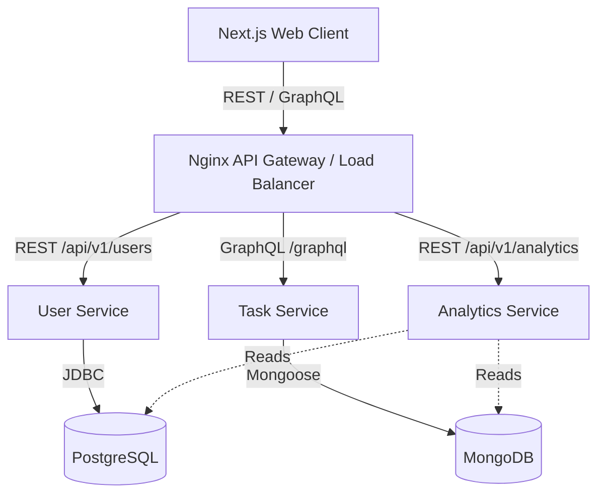

# StackSprint Architecture

This document describes the high-level architecture of the StackSprint ecosystem.

## High-Level System Architecture

We utilize a modern, decoupled microservices architecture with a dedicated frontend client.

## Microservice Tech Stack Overview

1. **Web Client (Frontend)**: Next.js (App Router), React 18, Tailwind CSS v4, Playwright E2E testing.
2. **User Service**: Java 17, Spring Boot 3, Spring Security (Stateless JWT), Hibernate, PostgreSQL, JUnit 5.
3. **Task Service**: Node.js 18, Express, Apollo GraphQL Server, Mongoose, MongoDB, Jest.
4. **Analytics Service**: Python 3.11, FastAPI, Pydantic, Pytest.

## DevOps & Infrastructure

- **Dockerization**: Every service is encapsulated in its own Docker container via multi-stage builds.
- **Orchestration**: `docker-compose.yml` links all services into a unified `stacksprint_net` bridge network.
- **CI/CD**: GitHub Actions provides continuous integration, running automated test suites for Java, Node, and Python on every push to the `develop` branch.
